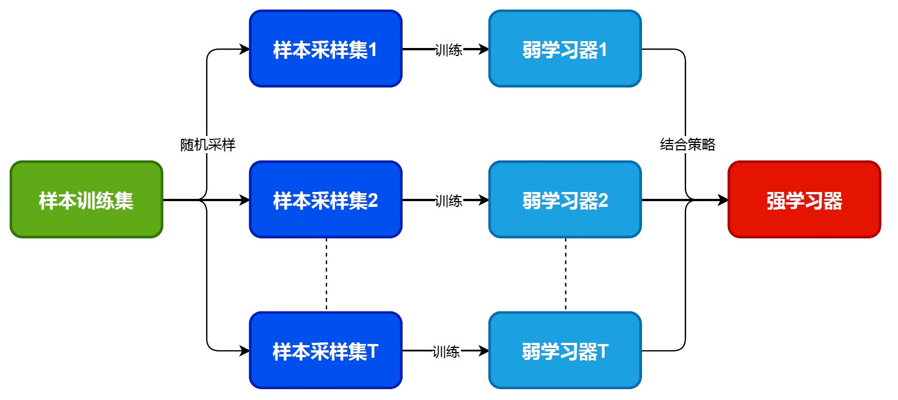

# Bagging

`Bagging`是集成学习中另一大阵营. 相比于`Boosting`, 它的各个弱学习器之间是没有依赖关系的, 并可以进行**并行拟合**. 本文就对`Bagging`以及著名的`随机森林`进行详细的介绍.

## 算法原理

从上图可以看出, `bagging`的特点就在于**随机采样**, 从而训练对应的弱学习器, 并最终进行融合.

### 随机采样

这里的随机采样是我们从训练集中采集固定个数的样本, **但这是有放回的采样**. 也就是说, 样本有可能会被重复采集到. 而在`Bagging`中, 一次随机采样一般会采集和训练集同样大小的样本量.

由此我们也可以计算出, 这样的采样方式大约有36.8%的数据是没有被采样的, 我们称之为**袋外数据**(OOB).

## 算法流程

`bagging`对于弱学习器是没有限制的, 但最常用的还是`决策树`和`神经网络`. 其对应的算法流程如下所示:

> 输入: 样本集$D=\{(x_1, y_1), (x_2, y_2), \ldots, (x_m, y_m\}$, 弱学习器算法, 迭代次数T
>
> 输出: 最终的强分类器$f(x)$
>
> 1. 对于$t=1, 2, \ldots, T$:
>
>    a. 对训练集进行第$t$次随机采样, 获得和训练集同样大小的采样集$D_t$
>
>    b. 利用采样集$D_t$训练第$t$个弱学习器$G_t(x)$
>
> 2. 如果是分类算法, 则使用投票的方式得到结果. 如果是回归算法, 则使用算数平均得到最终的结果.

## 随机森林

随机森林(Random Forest, 简称RF)可以说是`Bagging`算法的进化版. 首先它固定的使用`CART树`作为弱学习器. 其次, 它对决策树**建立的过程进行了一定程度上的修改**. 通常情况下进行节点划分, 会从所有的特征中选取最优特征来划分. 但是`RF`是通过**随机选取一部分特征**, 并在这些特征中选择一个最优特征进行划分. 这样就进一步增加了随机性, 从而提高了泛化能力.

关于整体的流程还是和`bagging`的流程一样, 故不在赘述.

### 优缺点

优点:

- 可以高度并行化, 对于大数据处理十分有利
- 由于划分特征是随机选取一部分再进行筛选, 因此即使特张维度很高也能有效执行
- 训练后, 可以给出各个特征的重要性
- 随机性大, 泛化能力强
- 相对于`Boosting`的算法, `RF`更易实现
- 对部分特征缺失不敏感

缺点:

- 对于小数据或者特征少的情况, 可能无法很好的分类
- 当噪声较大的时候, 容易出现过拟合的现象
- 是一个黑盒模型, 无法对其进行具体的控制