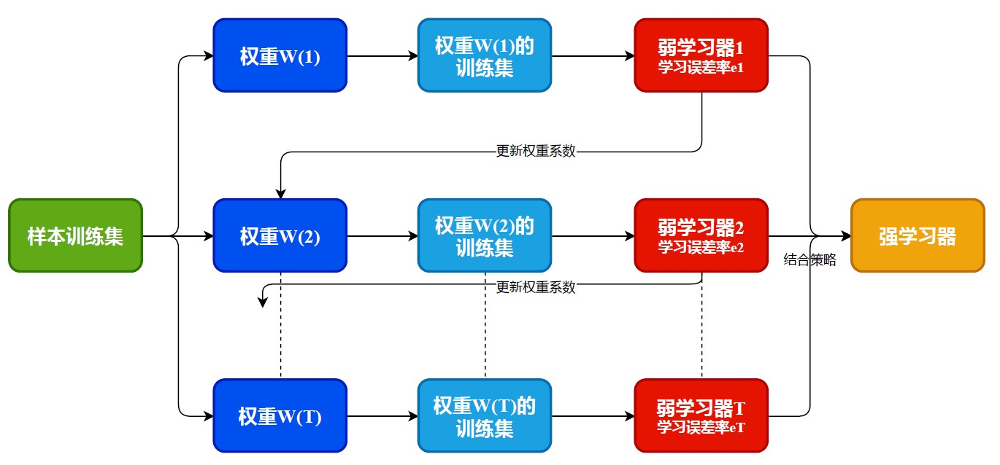

# Boosting

`Boosting`的核心就是通过学习一系列的`弱学习算法`, 并将其进行合理的组合，从而提升为`强学习算法`。因为`弱学习算法`通常要比`强学习算法`更容易发现，因此通过提升方法我们可以更加方便的获得`强学习算法`。

而对于提升方法, 有两个问题需要我们回答:

1. 在新的一轮中, 如何改变训练数据的权值或概率分布
2. 如何将弱分类器组合成一个强分类器.

对于即学习器的选择, 无论是`AdaBoost`, `GBDT`还是`XGBoost`, 通常都会选择决策树, 这是因为决策树自身的一些优势导致的:

- 易于理解, 可解释性强
- 预测速度快
- 相比于其他算法, 特征工程的工作量更小

## AdaBoost

对于上述两个问题, 在`AdaBoost`中分别给出了回答.

1. 在新的一轮中, 提高被**错误分类**的样本的权值, 降低被**正确分类**的样本权值. 通过这种方法让被分类错误的样本能过得到更多的关注.
2. 组合的方式是通过**加权多数表决**的方法, 即提高分类误差小的分类器的权值, 从而让其有更大的话语权, 同时减小分类误差大的分类器权值.

其主要的流程如下图所示:

### 优缺点

优点:

- 分类精度高
- 不容易发生过拟合

缺点:

- 对异常样本敏感. 异常样本会获得较高的权重, 从而影响模型的预测能力
- **损失函数是指数函数**, 不利进行计算

## GBDT

梯度提升(Gradient Boosting)是一种用于回归、分类和排序任务的机器学习算法, 属于`Boosting`算法的一族. 而梯度提升树(Gradient Boosting Decision Tree)则是使用`CART回归树`作为基函数的梯度提升算法, 以下简称`GBDT`. 相对于`AdaBoost`做了很大的提升. 下面总结了其主要区别的地方:

- 通过之前的描述, 我们知道`AdaBoost`只能处理**采用指数损失的二分类任务或者平方损失的回归任务**. 但是`GBDT`却可以使用任意形式的损失函数(只要它一阶可到). 从而可以选择更利于求解的损失函数, 提高计算效率.  
- `AdaBoost`是使用错分点来调整对应的权值分布, 而`GBDT`是直接使用负梯度对模型进行更新, 从而更加可靠快速. **因此GBDT可以使用更少的树和深度来获得更好的结果**

不过由于`XGBoost`的出现, 所以现在更会倾向于使用`XGBoost`. 我会在`XGBoost`的内容中详细的介绍具体的流程, 这里只是简单的介绍一下`GBDT`的原理.

在机器学习中, 我们优化的目标始终是损失函数, 其对应的参数是模型的权值和偏差. 而在`GBDT`中, 我们是通过不断的加入新的基学习器来增强模型, 因此我们可以把增加的基学习器当作我们的参数, 从而损失函数为$L[y, f(x)]$. 而通常我们进行参数的更新都是使用梯度下降法, ==GBDT正是采用类似的思想, 即让新的树去学习损失的梯度, 从而让损失最小化==. 对于第$m$步的模型$f_m(x)$, 可以有:
$$
f_m(x) = f_{m-1}(x) - \alpha\frac{\part}{\part f(x)}L[y, f(x)]|_{f(x) = f_{m-1}(x)}
$$
从而我们可以使用基学习器$G_m(x)$来拟合负梯度, 即:
$$
G_m(x) = -\frac{\part}{\part f(x)}L[y, f(x)]|_{f(x) = f_{m-1}(x)}
$$
之后进行模型更新, 从而让模型朝着损失函数最小化的方向更新:
$$
f_m(x) = f_{m-1}(x) + \alpha G_m(x)
$$

### 优缺点

优点:

- 可以灵活处理各种类型的数据, 包括连续值和离散值
- 在相对较少的调参时间下, 可以获得一个较高的精度(相对SVM)
- 使用一些健壮的损失函数, 对异常值的鲁棒性非常好.
- 模型集成的时候引入了正则化, 提高了模型的泛化能力

缺点:

- 难以并行训练(boosting的通用毛病)
- **基分类器只支持CART回归树**

## XGBoost

`XGBoost`算是对`GBDT`的一种优化和延申, 从而进一步的提高了集成算法的性能.  下面会从头到尾的来解释其具体过程.

### 加法模型

为了能够充分理解`XGBoost`算法, 我们首先需要知道获取下一个弱学习器的**指标**是什么, 以及整个添加流程是如何的.

由于`XGBoost`是`Boosting`大家庭的一员, 所以也是由一系列的基决策树组合而成的, 具体可以表示成如下形式:
$$
\hat{y}_i = \sum_{k=1}^{K}f_k(x_i), \quad f_k \in F
$$
其中$F$表示所有决策树组成的函数空间, $f_k$表示第$k$个基决策树. 从而模型的参数其实就是基决策树$\Theta = \{f_1, f_2, \ldots, f_K\}$. **与传统的机器学习算法不同, 加法模型不是学习模型中的权值, 而是直接学习函数(决策树)集合**.

由此就可以定义我们的目标函数:
$$
Obj = \sum_{i=1}^{N}l(y,\hat{y}_i) + \sum_{k=1}^{K}\Omega(f_k)
$$
上式中$\Omega(f_k)$表示的对应决策树的复杂度, 主要起到正则项的作用. 关于树的复杂度可以使用`树的深度`, `树的叶节点数`, `树的节点数`等对应的2范数来定义. 

接下来我们来看具体的加法模型流程, 主要采用的就是`前向分布算法`, 每次学习一个基学习器并更新. 具体的流程如下所示:
$$
\begin{aligned}
y_i^0 &= 0 \\
y_i^1 &= y_i^0 + f_1(x_i) \\
y_i^2 &= f_1(x_i) + f_2(x_i) = y_i^1 + f_2(x_i) \\
& \ldots \\
y_i^K &= \sum_{k=1}^{K}f_k(x_i) = y_i^{K-1} + f_K(x_i)

\end{aligned}
$$
假如我们训练到第$t$步, 我们又该如何选择下一个基学习器$f_t$加入呢? **其实采用的思想还是最小化目标函数的思想**, 即和传统的模型训练是一样的. 当到了第$t$步, 我们可以得到目标函数为:
$$
\begin{aligned}
Obj^{(t)} &= \sum_{i=1}^{N}l(y_i, \hat{y}_i^t) + \sum_{k=1}^{t}\Omega(f_k) \\
		  &= \sum_{i=1}^{N}l(y_i, \hat{y}_i^{t-1} + f_t(x_i)) + \Omega(f_t) + constant
\end{aligned}
$$
这个推导过程还是比较好理解的, 因为在第$t$中我们只要由基学习器$f_t$引入的东西作为变量, 之前的结果都可以作为常量对待.

对于之后的推导需要通道`泰勒公式`, 这里我们先熟悉一下`二阶泰勒公式`:
$$
f(x + \Delta x) = f(x) + f'(x)\Delta x + \frac{1}{2} f''(x) \Delta x^2
$$
==由于目标函数中的损失函数是关于$\hat{y}_i^{t-1} + f_t(x_i)$的函数, 所以我们把$\hat{y}_i^{t-1}$类比成$x$, 把$f_t(x_i)$类比成$\Delta x$,== 从而我们可以得到:
$$
l(y_i, \hat{y}_i^{t-1} + f_t(x_i)) = l(y_i, \hat{y}_i^{t-1}) + l'(y_i, \hat{y}_i^{t-1})f_t(x_i) + \frac{1}{2}l''(y_i, \hat{y}_i^{t-1})f_t^2(x_i)
$$
我们定义损失函数一阶导数为$g_i$, 损失函数的二阶导数为$h_i$, 并将泰勒展开的结果带入的原目标函数, 可以得到:
$$
\begin{aligned}
Obj^{(t)} &= \sum_{i=1}^{N}(l(y_i, \hat{y}_i^{t-1}) + g_if_t(x_i) + \frac{1}{2}h_if_t^2(x_i)) + \Omega(f_t) + constant \\
		  &= \sum_{i=1}^{N}(g_if_t(x_i) + \frac{1}{2}h_if_t^2(x_i)) + \Omega(f_t)
\end{aligned}
$$
最终的目标函数中, 我们将不需要的常数项都舍弃掉, 从而得到上述的表达式. 从最终的表达式, 我们可以看出**只要计算出损失函数一阶导数和二阶导数, 我们就可以利用训练集来最小化目标函数, 从而求得我们要学习的函数$f_t$**. 由此我们知道加法模型的过程, 以及如何获得下一个基学习器.

### 计算损失函数

上述的流程让我们知道如果获取我们的损失函数, 但没有涉及到具体的求解. 这一部分会讲解**在确定树的结构的前提下, 如何具体计算加入之后的目标函数, 从而可以将其作为评判依据**.

首先我们对一颗决策树进行定义, 设其节点数为$T$, 其对应的参数向量为$w \in R^T$, 以及一个把特征向量映射到叶子节点索引的函数$q:R^d \rightarrow \{1, 2, \ldots, T\}$组成的, 从而可以把决策树定义为:
$$
f_t(x) = w_{q(x)}
$$
决策树的复杂度可以由生成的树的叶子节点和对应参数的2范数来决定, 即:
$$
\Omega(f_t) = \gamma T + \frac{1}{2} \lambda \sum_{j=1}^{T}w_j^2
$$
定义集合$I_j=\{i|q(x_i) = j\}$为所有被划分到叶子节点$j$的训练样本的集合, 从而将对应的表达式代入目标函数, 我们可以得到:
$$
\begin{aligned}
Obj^{(t)} &= \sum_{i=1}^{N}\left[g_iw_{q(x_i)} + \frac{1}{2}h_iw_{q(x_i)}^2\right] + \gamma T + \frac{1}{2}\lambda \sum_{j=1}^{T}w_j^2 \\
		  &= \sum_{j=1}^{T}\left[(\sum_{i\in I_j}g_i)w_j + \frac{1}{2}(\sum_{i \in I_j} h_j)w_j^2\right] + \gamma T + \frac{1}{2}\lambda\sum_{j=1}^{T}w_j^2 \\
		  &= \sum_{j=1}^{T}\left[G_jw_j + \frac{1}{2}H_jw_j^2\right] + \gamma T + \frac{1}{2}\lambda\sum_{j=1}^{T}w_j^2 \\
		  &= \sum_{j=1}^{T}\left[G_jw_j + \frac{1}{2}(H_j+\lambda)w_j^2\right] + \gamma T
\end{aligned}
$$

假设树的结构是确定的, 即映射关系$q(x)$是确定的, 此时我们的变量只有$w$. 为了求目标函数的最优解, 直接令其一阶导数为0, 即可得到叶子节点$j$对应的值为:
$$
w_j = -\frac{G_j}{H_j+\lambda}
$$
将其结果带入方程, 我们可以得到当加入的树结构确定的情况下, 模型的最小损失的值, 即:
$$
Obj^{(t)}_{min} = \sum_{j=1}^{T}-\frac{G_j^2}{2(H_j+\lambda)} + \gamma T
$$
可以发现, 当树的结构确定的时候, 我们可以直接通过损失函数的一阶导、二阶导以及新树的叶子节点即可得到代价结果. 从而方便我们对这一颗树进行评判.

### 算法流程

结合上述的加法模型流程以及具体的评判指标, 我们已经可以总结GBDT的具体算法流程.

> 1. 枚举所有可能的树结构$q$
> 2. 计算每个树的对应的代价函数$Obj$, 分数越小的则表明树的结构越好
> 3. 找到最优的树结构, 并使用公式计算对应的叶子节点值$w$, 并将新树加入到模型当中, 完成更新.

然而在实际的算法当中, 我们**不可能**枚举所有的树结构, 因为这个数量是无穷的. 通常情况下, 我们会采用`贪心算法`来实现. 具体的流程如下所示:

> 1. 从深度为0的树开始, 对每个叶节点枚举所有的可用特征
> 2. 针对每个特征, 我属于该节点的样本根据该特征升序排列, 通过线性扫描的方法寻找到最佳的分裂点, 并记录该特征的最大收益(采用对应最佳分裂点的收益).
> 3. 选择最大收益的特征以及对应的最佳分裂点, 将该节点的样本进行分成两类, 并为新的子节点关联对应的样本.
> 4. 递归回到第一步, 直到满足指定条件为止.

在上述的流程中的第2步, 涉及计算分裂点的对应收益, 这个收益定位为**当前节点的目标函数减去分割之后的目标函数之和**, 即$Gain = Obj_{cur} - Obj_{next}$. 我们可以知道, **收益越大, 则分类结果越好**.

由于我们每次只会分裂一个节点, 所以我们不妨把要分裂的部分单独拿出来考虑, 不妨设要分裂的节点是最后一个节点, 从而目标函数写成如下形式:
$$
\begin{aligned}
Obj_{cur} &= \sum_{j=1}^{T-1}-\frac{G_j^2}{2(H_j+\lambda)} + (-\frac{G_T^2}{2(H_T+\lambda)}) + \gamma T \\
Obj_{next} &= \sum_{j=1}^{T-1}-\frac{G_j^2}{2(H_j+\lambda)}+(-\frac{G_{L}^2}{2(H_{L}+\lambda)} - \frac{G_{R}^2}{2(H_{R} + \lambda)}) + \gamma (T + 1)
\end{aligned}
$$
其中, 我们可以知道, 分裂出的子节点的样本是从父节点那里获取到的, 所以对应损失函数的倒数会有:
$$
\begin{aligned}
G_T &= G_L + G_R \\
H_T &= H_T + H_R
\end{aligned}
$$
另外, 我们可以从$Obj_{cur}$和$Obj_{next}$中发现两者之间很多项都是一样的, 从而两者相减后的表达式可以简化为:
$$
Gain = Obj_{cur} - Obj_{next} = \frac{1}{2}\left[\frac{G_L^2}{H_L+\lambda} + \frac{G_R^2}{H_R+\lambda} - \frac{(G_L + G_R)^2}{H_L+H_R+\lambda}\right] - \gamma
$$
从而我们成功获得了增益计算的表达式. 我这样的解释更加清晰, 对应的推导过程具有实际意义. 而网上教程中的给的推导过程并不明确. 结合以上两个流程, 我们可以得到`GBDT`的最终算法流程如下所示.

> 1. 初始化模型
> 2. 计算损失函数相对于每一个样本的一阶导数$g_i$和二阶导数$h_i$
> 3. 利用导数和贪心算法, 生成新的决策树, 并计算对应的每个叶子节点的值
> 4. 把新的树加入到原模型中, 即$\hat{y}_i^t = \hat{y}_i^t-1 + \epsilon f_t(x_i)$, 这里多了一个步长参数, **用于防止模型过拟合**.
> 5. 判断模型是否满足终止条件, 若满足则退出, 否则回到步骤2.

### 优缺点

优点:

- 相比于`GBDT`只能使用决策树作为基学习器, `XGBoost`还可以使用**线性分类器**
- 利用了**二阶**的信息, 从而更加有利于梯度下降
- 在代价函数中的引入了**正则项**, 这在`GBDT`中是没有的. 从而降低了过拟合的可能性
- `XGBoost`在生成树的过程中, 选择分裂特征和分裂点时可以支持并行操作, 从而提高了计算效率
- 具有缺失值处理的能力

缺点:

- 选择分割特征和分割点的时候需要进行预排序, 数据量大的时候较为耗时

