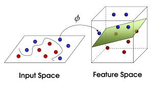

# SVM

支持向量机可以看作是对感知机的一种优化. 在感知机当中, 我们期望找到一个**超平面**来将**线性可分**的数据进行分割, 从而实现分类.

但实际上同样的数据集可以有无数多个超平面, 我们希望找到鲁棒性最好的超平面, 从而保证其泛化能力最强. `SVM`本质上就是找到这个**最佳超平面**, 从而实现最佳分类.

目前`SVM`主要分为三种向量机: `线性可分支持向量机`, `线性支持向量机`, `非线性支持向量机`. 下面将介绍三者之间的主要区别以及适用范围.

## 间隔标准

### 定义

我们期望找到最佳的超平面, 即**两侧的样本离平面的最小间隔是所有超平面中最大的**. 为此, 我们需要首先给出间隔的定义, 才可以进行具体的比较.x

模型主要训练的参数为$(w, b)$, 从而获得我们样本的预测输出$w \cdot x + b$. 而参数确定下, 我们的超平面就可以表示成如下形式:
$$
w \cdot x + b = 0
$$
从而我们就可以把$|w \cdot x + b|$作为样本离超平面的距离. 同时我们还需要知道分类的正确性, 这个可以用标记$y$实现, 从而进行组合得到$y(w \cdot x + b)$即可同时表示预测结果的正确性和可信度. 从而将其定位我们的**函数间隔**. 即对于超平面$(w, b)$关于单个样本点$(x_i, y_i)$的函数间隔为:
$$
\hat{\gamma_i} = y_i(w \cdot x_i + b)
$$
但是上述的**函数间隔**会收到参数大小的影响, 从而不利于比较, 因此我们需要对其进行**归一化**, 从而引出我们的**几何间隔**. ==这里我们使用$w$进行规范化==.
$$
\hat{\gamma_i} = y_i(\frac{w}{||w||_2}x_i + \frac{b}{||w||_2})
$$

### 优化函数

优化函数也即我们需要确定的目标, 和上述一样, 我们希望获取不同超平面下的最小几何间隔集合, 并从中获取最大的几何间隔对应的超平面参数. 可以用下面的形式表示:
$$
\begin{aligned}
\max_{w, b} & \quad \gamma \\
s.t. & \quad y_i(\frac{w}{||w||_2}x_i + \frac{b}{||w||_2}) \geq \gamma,
\quad i=1, 2, \ldots N
\end{aligned}
$$
这个优化函数优化的是最终的几何间隔, 不过为了方便进行表示, 我们可以把它转化成函数间隔.
$$
\begin{aligned}
\max_{w, b} & \quad \frac{\hat{\gamma}}{||w||_2} \\
s.t. & \quad y_i(w \cdot x_i +b) \geq \hat{\gamma},
\quad i=1, 2, \ldots N
\end{aligned}
$$
由于$\hat{\gamma}$的大小主要是收到参数比例影响, 和优化的目标关系并不大. 所以我们可以直接将其设置为1, 对应的参数直接按比例缩放即可. 另外最大化$\frac{1}{||w||_2}$和最下化$\frac{1}{2}||w||^2$是一样的, 从而优化函数可以最终变成如下形式:
$$
\begin{aligned}
\min_{w, b} & \quad \frac{1}{2}||w||^2 \\
s.t. & \quad y_i(w \cdot x_i +b) - 1 \geq 0,
\quad i=1, 2, \ldots N
\end{aligned}
$$
这是一个**凸二次规划**问题, `SVM`的根本就是去解决这种优化问题.

## 线性可分支持向量机

 这类向量机使用的前提条件就是数据是**线性可分** 的, 因此最大间隔的分离超平面是**唯一确定**的.

下面是对该问题的一个具体求解过程, 需要仔细理解. ==针对凸二次规划问题, 我们通常使用拉格朗日乘子法进行求解==.

首先我们引入拉格朗日乘子, 从而将优化方程转换成函数:
$$
L(w, b, \alpha) = \frac{1}{2}||w||^2 + \sum_{i=1}^{N}\alpha_i(1 - y_i(w \cdot x_i + b))
$$
从而我们就可以把之前的优化问题转变成如下问题:
$$
\min_{w, b}\max_{\alpha_i \geq 0}L(w, b, \alpha) = 
\min_{w, b}\max_{\alpha_i \geq 0}[\frac{1}{2}||w||^2 + \sum_{i=1}^{N}\alpha_i(1 - y_i(w \cdot x_i + b))]
$$
这一步的转换应用到了拉格朗日对偶方面的知识, 如果忘记了可以查看对应的笔记进行复习.

而原始问题的求解是比较复杂的, 故我们转化成求解其对偶问题, 即:
$$
\max_{\alpha_i \geq 0}\min_{w, b}L(w, b, \alpha)​
$$
我们先求解里面的部分, 从而可以得到:
$$
\min_{w, b} L(w, b, \alpha):
\begin{cases}
\nabla_{w}L(w, b, \alpha) &= w - \sum_{i=1}^{N}\alpha_iy_ix_i = 0 \\
\nabla_{b}L(w, b, \alpha) &= -\sum_{i=1}^{N}\alpha_iy_i = 0
\end{cases}
$$
通过计算我们可以从中得到:
$$
\begin{cases}
w &= \sum_{i=1}^{N}\alpha_iy_ix_i \\
\sum_{i=1}^{N}\alpha_iy_i &= 0
\end{cases}
$$
将对应的结果带入方程当中, 我们就可以得到:
$$
\begin{aligned}
L(w, b, \alpha) &= \frac{1}{2}\sum_{i=1}^{N}\sum_{j=1}^{N}\alpha_i\alpha_jy_iy_j(x_i \cdot x_j) + \sum_{i=1}^{N}\alpha_i(1 - y_i(\sum_{j=1}^{N}\alpha_iy_i(x_i \cdot x_j) + b))\\
&= -\frac{1}{2}\sum_{i=1}^{N}\sum_{j=1}^{N}\alpha_i\alpha_jy_iy_j(x_i \cdot x_j) - \sum_{i=1}^{N}\alpha_iy_ib + \sum_{i=1}^{N}\alpha_i \\
&= -\frac{1}{2}\sum_{i=1}^{N}\sum_{j=1}^{N}\alpha_i\alpha_jy_iy_j(x_i \cdot x_j) + \sum_{i=1}^{N}\alpha_i
\end{aligned}
$$
从而我们可以得到我们更新后的目标优化函数:
$$
\begin{aligned}
\max_{\alpha} & \quad -\frac{1}{2}\sum_{i=1}^{N}\sum_{j=1}^{N}\alpha_i\alpha_jy_iy_j(x_i \cdot x_j) + \sum_{i=1}^{N}\alpha_i \\
s.t. & \quad \sum_{i=1}^{N}\alpha_iy_i = 0 \\
& \quad \alpha_i \geq 0, \quad i=1, 2, \ldots, N
\end{aligned}
$$
对上述问题进行求解, 我们可以得到$\alpha$的解为$\alpha^* = (\alpha_1^*,\alpha_2^*, \ldots, \alpha_l^*)^T$. 并由此, 我们可以求得参数对应的解:
$$
\begin{aligned}
w &= \sum_{i=1}^{N}\alpha_iy_ix_i \\
b &= y_j - \sum_{i=1}^{N}\alpha_iy_i(x_i \cdot x_j)
\end{aligned}
$$
由此我们完成了`线性可分支持向量机`的参数求解.

但是我们需要知道, 这种对偶解法是建立在对偶函数和原函数的解一致的基础上, 而这种基础的条件是对偶问题最优解满足`KKT`条件.  而通过证明SVM是满足这个条件的, 所以可以通过拉格朗日对偶法进行求解.

## 线性支持向量机

这个向量机主要针对的**线性不可分**的情况, 即我们通过添加松弛变量$\xi_i$, 来允许部分样本可以在间隔区域内, 我们称这种间隔为**软间隔**. 
$$
y_i(w \cdot x_i + b) \geq 1 - \xi_i
$$
但同时我们也需要对这种不正常的样本数据进行惩罚, 惩罚系数$C$越大, 则越严格, 反之则越宽松. 从而可以得到我们的二次凸规划问题:
$$
\begin{aligned}
\min_{w, b, \xi} &\quad \frac{1}{2}||w||^2 + C\sum_{i=1}^{N}\xi_i \\
s.t. & \quad y_i(w \cdot x_i + b) \geq 1 - \xi_i, \quad i=1, 2, \ldots, N\\
& \quad \xi_i \geq 0, \quad i=1, 2, \ldots, N
\end{aligned}
$$
求解的思路和`线性可分支持向量机`的思路是一致的, 我这里直接写出最终的优化函数:
$$
\begin{aligned}
\max_{\alpha} & \quad -\frac{1}{2}\sum_{i=1}^{N}\sum_{j=1}^{N}\alpha_i\alpha_jy_iy_j(x_i \cdot x_j) + \sum_{i=1}^{N}\alpha_i \\
s.t. & \quad \sum_{i=1}^{N}\alpha_iy_i = 0 \\
& \quad 0 \leq \alpha_i \leq C, \quad i=1, 2, \ldots, N
\end{aligned}
$$
同样可以证明其最优解满足`KKT`条件, 所以可以使用拉格朗日对偶方法.

## 非线性支持向量机

有些情况, 即使使用`线性支持向量机`也无法寻找到合适的超平面. 这个时候我们可以尝试将数据集映射到高维, 或许就可以将数据变成线性可分的, 从而继续使用线性可分的方法来求解.

针对这种情况, 一般使用的是`核函数`来进行维度映射, 具体情况可以见下图.

此时优化函数中的内积$x_i \cdot x_j$可以直接更换成和函数$K(x_i, x_j)$. 从而优化函数为:
$$
\begin{aligned}
\max_{\alpha} & \quad -\frac{1}{2}\sum_{i=1}^{N}\sum_{j=1}^{N}\alpha_i\alpha_jy_iy_jK(x_i, x_j) + \sum_{i=1}^{N}\alpha_i \\
s.t. & \quad \sum_{i=1}^{N}\alpha_iy_i = 0 \\
& \quad 0 \leq \alpha_i \leq C, \quad i=1, 2, \ldots, N
\end{aligned}
$$

### 常用核函数

- 线性核函数
  $$
  K(x_i, x_j) = x_i \times x_j
  $$
  主要用于线性可分的情况, 并且参数少, 计算速度快. 通常我们会先使用线性核进行尝试分类, 观察具体效果. 如果不行再考虑其他核函数.

- 多项式核函数
  $$
  K(x_i, x_j) = (x_i \cdot x_j + 1)^p
  $$
  

- 高斯径向基核函数(RBF)
  $$
  K(x_i, x_j) = exp(-\frac{||x_i - x_j||^2}{2\sigma^2})
  $$
  应用广, 无论是大样本还是小样本都有较好的性能. 因此大多数情况下, 优先使用高斯核函数.

### 核函数的选择

- 特征数量足够, 和样本数量差不多, 可以选择LR或者线性核函数的SVM
- 特征数量较少, 样本数量一般, 可以选择高斯核函数的SVM
- 特征数量较少, 样本数量足够, 需要手工添加一些特征变成第一种情况

## SVM总结

优点:

- 对于解决高维特征的**分类问题**和**回归问题**很有效
- 仅仅使用一部分支持向量即可进行超平面的决策, 无需依赖全部数据, 避免了"维度灾难"
- 有大量的核函数使用, 可以灵活解决非线性问题
- **样本量不是海量的情况下,** 精度高, 泛化能力强

缺点:

- 难以选择一个合适的核函数
- 对缺失数据十分敏感, **因为牵扯到距离的运算**
- 海量数据的情况下, 其精度不高
- 不适合于多分类任务