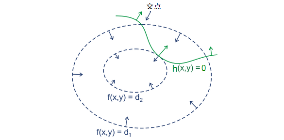
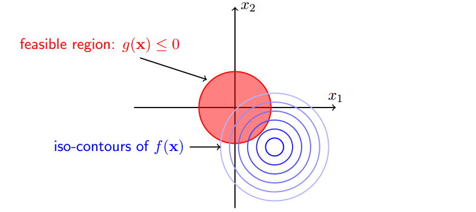
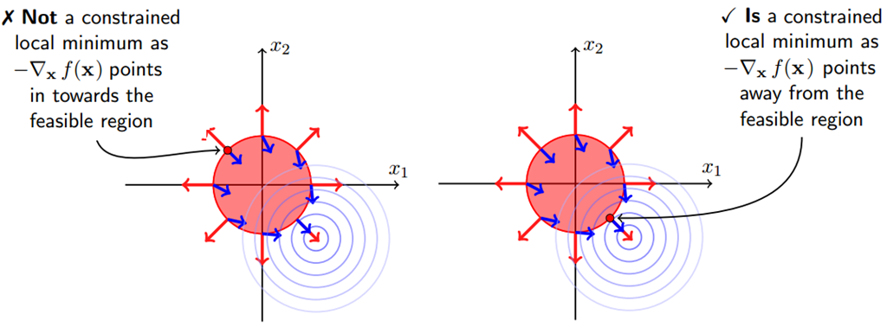

> 这一部分的内容主要介绍学习过程中我们需要使用到的数学方法和概念, 便于更深一步的理解.

# 拉格朗日乘子法

拉格朗日乘子法主要针对的是==带有约束的最优化问题==. 根据约束是否还有不等式可以分成两种情况:

- 对于等式约束的优化问题, 可以直接应用`拉格朗日乘子法`去求最优值. 
- 对于含有不等式约束的优化问题, 可以转化成满足`KKT`约束条件下应用`拉格朗日乘子法`进行求解.

下面会对这两种情况进行分别的讲解. 我们需要知道, 只有在`凸优化`的情况才能保证获得最优解. 因此这里我称为方程的解为**可行解**, 也就是局部最优解.

## 无约束优化

$$
\min_{x} f(x)
$$

这种就是最常见的优化函数, 直接令其导数为0即可, 即$\nabla_xf(x) = 0$. 如果没有解析解的话, 可以使用梯度法或者牛顿法来逼近极小值点.

## 等式约束优化

$$
\begin{aligned}
\min_{x} & \quad f(x) \\
s.t. & \quad h_i(x) = 0, \quad i=1, 2, \ldots, m
\end{aligned}
$$

首先我们给出它的具体意义, 从而更便于我们对公式的理解. 假设目标函数是$f(x, y)$, 其对应的函数曲线如下图中虚线所示. 同时有一个约束等式$h(x, y)=0$, 其对应的曲线如下图中的绿色所示. 因此两者之间的关系主要有三种, `相交`、`相切`以及`没有交集`. 从中我们可以发现, 可行解一定会出现在`相切`的位置.

相切点处的法向量是平行的. 所以为了求相切点出的解, 我们需要求解如下方程:
$$
\nabla_x f(x) + \alpha\nabla_x h(x) = 0
$$
所以只要同时满足上述的方程且满足之前的约束$h_i(x) = 0, \quad i=1, 2, \ldots, m$, 那么最终得到的解就是我们的可行解.

由此我们再回顾拉格朗日乘子法的过程, 我们首先引入拉格朗日乘子, 从而构建方程:
$$
L(x, \alpha) = f(x) + \sum_{i=1}^{m}\alpha_ih_i(x)
$$
并分别对$x$和$\alpha$求偏导, 令偏导为0, 从而我们可以得到:
$$
\begin{cases}
\nabla_x L(x, \alpha) &= \nabla_x f(x) + \sum_{i=1}^{m} \alpha_i \nabla_x h_i(x) = 0 \\
\nabla_{\alpha_{i}} L(x, \alpha) &= h_i(x) = 0, \quad i=1, 2, \ldots, m
\end{cases}
$$
可以发现这两步之后, 就将问题转换成我们之前需要求解的两个方程, 从而就可以得到优化方程的可行解.

## 不等式约束优化

$$
\begin{aligned}
\min_{x} & \quad f(x) \\
s.t. & \quad g(x) \leq 0
\end{aligned}
$$

我们按照等式约束优化那样构造出对应的拉格朗日方程:
$$
L(x, \lambda) = f(x) + \lambda g(x)
$$
同样的, 我们先了解一下约束函数的实际意义, 其实它就是规划出了一片区域, 要在这片区域中找到可行解. 下图给出了约束函数和目标函数的关系.

从图中我们可以看到, 可行解的情况主要只有两种:

- 当原函数的最优解在内部时, 可行解在约束区域**内部**. 此时约束条件失效, 直接求解目标函数的可行解即可. 即此时我们可以令$\lambda= 0$.
- 当原函数的最优解在外部是, 可以解在约束区域**边界上**. 此时就和等式约束的情况是一样的, 即$g(x)=0$.

从而我们可以知道, 无论那种情况, 我们都可以得到:
$$
\lambda g(x) = 0
$$
在此基础上, 我们还需要考虑$\lambda$的取值. 同样的我们要从两种情况进行考虑, 当可行解在内部时, 我们可以知道$\lambda=0$. 当可行解在边界上的时候, 我们可以发现在可行解处, ==$f(x)$和$g(x)$的法向量是相反的==, 可以通过下图进行查看.

所以我们可以得到如下的关系式:
$$
-\nabla_x f(x) = \lambda \nabla_x g(x)
$$
==上述等式的成立条件是$\lambda > 0$==. 从而我们看到, 相比于等式约束, 不等式约束会多出两个附加条件, 分别是针对$\lambda$和$\lambda g(x)$.

## 一般情况

现在让我们考虑最一般的情况, 即同时存在等式约束和不等式约束的条件下:
$$
\begin{aligned}
\min_x & \quad f(x) \\
s.t. & \quad h_i(x) = 0, \quad i=1, 2, \ldots, m \\
	 & \quad g_j(x) \leq 0, \quad j=1, 2, \ldots, m
\end{aligned}
$$
直接引入拉格朗日乘子, 从而可以构造方程如下所示:
$$
L(x, \alpha, \beta) = f(x) + \sum_{i=1}^{m}\alpha_ih_i(x) + \sum_{j=1}^{n}\beta_jg_j(x)
$$
对于上述方程, 可行解$x$需要满足如下一系列条件, 我们也将其称为`KKT条件`:
$$
\begin{aligned}
\nabla_x L(x, \alpha, \beta) &= 0 \\
\beta_j g_j(x) & = 0, \quad j =1, 2, \ldots, n \\
h_i(x) &= 0, \quad i = 1, 2, \ldots, m \\
g_i(x) & \leq 0, \quad j = 1, 2, \ldots, n \\
\beta_j &\geq 0, \quad j = 1, 2, \ldots, n
\end{aligned}
$$
**满足KKT条件后的极小化拉格朗日方程即可得到在不等式约束下的可行解**.

## 拉格朗日对偶

对于上面提到关于不等式约束的情况, 只是表明了如果存在可行解, 那么可行解一定会满足`KKT`条件, 但并没有讲解该如何进行求解. 我们在等式约束中可以看到可以直接通过对$x$和$\alpha$求偏导即可, 但在不等式约束是要更加复杂一点的, 有的时候我们要用到拉格朗日对偶性, **这在SVM中就被使用到**.

==这里主要介绍为什么在原问题难以求解的情况下, 可以通过拉格朗日对偶性来对原问题进行求解.==

首先我们先了解一些`对偶问题`的性质:

- 对偶问题的对偶就是原问题
- 无论原问题是否是凸优化问题, 对偶问题都是凸优化问题
- 对偶问题可以给原问题一个下界
- 当满足一定条件时, 原始问题和对偶问题的可行解是等价的(SVM中会用到)

为了方便理解, 我们先定义我们的**原始问题**:
$$
\begin{aligned}
\min_x & \quad f(x) \\
s.t. & \quad h_i(x) = 0, \quad i=1, 2, \ldots, m \\
	 & \quad g_j(x) \leq 0, \quad j=1, 2, \ldots, m
\end{aligned}
$$
接下来我们需要考虑如何把约束融合到目标方程中, 从而转换成无约束的目标问题. 

首先我们先引入拉格朗日乘子:
$$
L(x, \alpha, \beta) = f(x) + \sum_{i=1}^{m}\alpha_ih_i(x) + \sum_{j=1}^{n}\beta_jg_j(x)
$$
通过上式, 我们可以得到一个关键性质:
$$
f(x) = \max_{\alpha \beta; \beta_j \geq 0} L(x, \alpha, \beta) \geq L(x, \alpha, \beta)
$$
证明这个性质是比较好证明的, 我们可以知道满足条件约束的$x$会让$h_i(x)=0$, 从而可以把这一项舍弃掉. 另外我们知道$g_j(x)\leq0$, $\beta_j \geq 0$, 因此会有$\beta_j g_j(x) \leq 0$的结果, 即这一项的最大值为0, 从而我们可以知道$\max_{\alpha \beta; \beta_j \geq 0} L(x, \alpha, \beta)$即为我们的目标函数$f(x)$. 从而我们的原始问题就可以转化成如下问题:
$$
\min_x f(x) = \min_{w, b}\max_{\alpha\beta;\beta_j \geq 0}L(x, \alpha, \beta)
$$

### 对偶问题性质

当原问题不方便进行求解的时候, 我们会考虑通过求解对偶问题来得到对应的答案, 但这有一定的前提条件. 我们需要了解`弱对偶性`和`强对偶性`.

- 弱对偶性

  这个性质对于所有的优化问题都是成立的, 即使原始问题是非凸的. 在这个性质下, **对偶问题的解是原始问题的一个下界**. 即我们可以通过求解对偶问题来获得原始问题的一个下界.

- 强对偶性

  强对偶性是一个更好的性质, 但它成立的条件也更苛刻. **在强对偶性成立的情况下, 对偶问题的解就是原始问题的解**, 因此我们可以通过求解对偶问题(一般更容易求解)来获得原始问题的解. 这在SVM中就使用过. 但强对偶性要成立的前提是满足**KKT条件**.

这里要声明一下, 强对偶性和KKT条件两者是充分必要的, 即能通过一方推导出另一方. 关于具体的推导过程可以看这一片[文章](https://www.cnblogs.com/ooon/p/5723725.html).